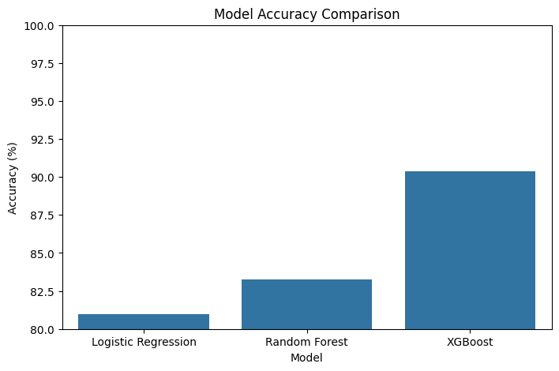
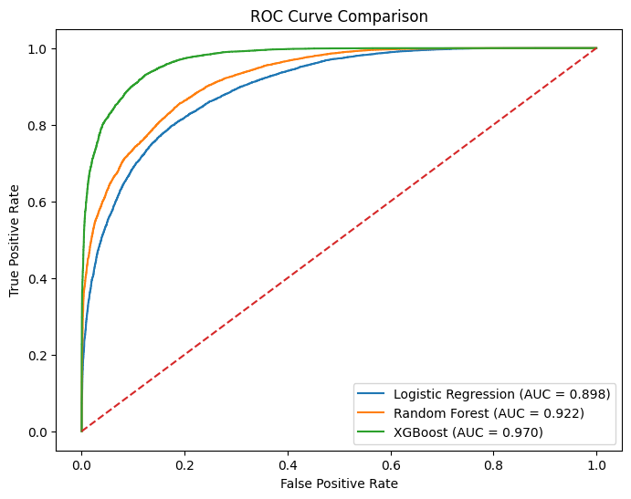
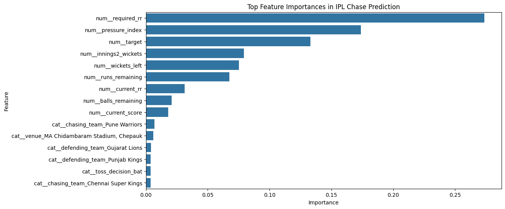
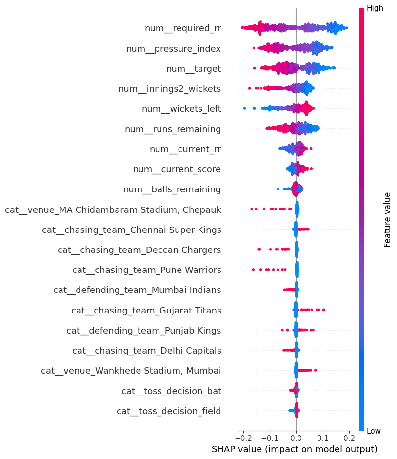

<h1 align="center">🏏 IPL Match Intelligence</h1>

<p align="center">
  
</p>

<p align="center">
  
  
  
  
  
</p>

---

# 🚀 About The Project

🏏 An advanced cricket analytics + machine learning project that predicts IPL chase outcomes using real-time match pressure, wickets, momentum, and run-rate dynamics.

This project combines:

✨ Exploratory Data Analysis  
🤖 Machine Learning Models  
📊 SHAP Explainability  
🔥 Pressure Index Engineering  
🎯 Live Match Prediction  
🌐 Streamlit Deployment

---

# 🧠 Problem Statement

> What actually separates a successful IPL chase from a collapse under pressure?

This project studies live chase behavior using:

- 🎯 Target Score
- ⚡ Required Run Rate
- 🏏 Wickets Left
- 🔥 Pressure Index
- ⏳ Balls Remaining
- 📍 Venue Effects
- 🪙 Toss Decision
- 📈 Momentum Patterns

---

# 🏆 Final Model Performance

| 🚀 Model | 🎯 Accuracy | 📊 AUC Score |
|---|---|---|
| Logistic Regression | 80.96% | 0.898 |
| Random Forest | 83.25% | 0.922 |
| XGBoost 🔥 | **90.35%** | **0.970** |

---

# 🔥 Why XGBoost Won

✅ Captured pressure-based collapses  
✅ Learned wicket-risk interactions  
✅ Understood death-over pressure  
✅ Best class separation  
✅ Highest prediction confidence

---

# 📊 Dashboard Preview

## 🏏 Model Comparison



## 📈 ROC Curve



## 🧠 Feature Importance



## 🔍 SHAP Explainability



---

# ⚡ Streamlit Features

✨ Live IPL Chase Predictor  
📊 Interactive Analytics Dashboard  
🔥 Pressure Analysis  
🧠 SHAP Explainability  
🎯 Match Situation Notes  
📈 Model Comparison  
🏏 Team & Venue Insights

---

# 🛠️ Tech Stack

<p align="center">


</p>

- Python
- Pandas
- NumPy
- Scikit-learn
- XGBoost
- SHAP
- Streamlit
- Matplotlib

---

# 📂 Project Structure

```bash
IPL-Match-Intelligence/
│
├── app.py
├── ipl.ipynb
├── ipl_chase_model.pkl
├── requirements.txt
├── README.md
│
├── images/
│   ├── model_accuracy_comparison.png
│   ├── roc_curve_comparison.png
│   ├── feature_importance.png
│   └── summary_plot.png
│
└── ipl.csv